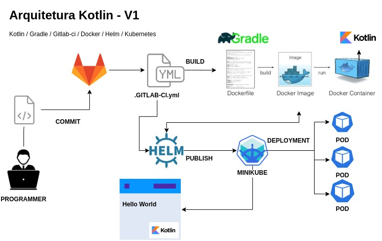

# TEO - Resultado de Desafio.

Este é um case para aplicação de tecnologias emergentes e com métodos aplicáveis em um ambiente empresarial.



## Etapas de Entrega do Projeto.

Containerização de uma aplicação em Kotlin.
Criação de um Helm chart para rodar em um cluster kubernetes.
Criação de uma Pipeline no GitLab CI.
Criação de uma Infraestrutura como código descrita em Terraform.
Criação da Infraestrutura como código na AWS via Pipeline.

## Exigências.

Pacotes necessários para execução deste case no GNU/Linux

* git >= 2.20.1
* Docker >= 19.03.8
* Helm >= 3.1.2
* Minikube >= 1.3.1
* Kotlin >= 1.2.61
* GitLab CI >= 12.9.0
* Gradle >= 4.10
* Terraform >= 0.12.24
 
## Exemplo de uso.

Para a reproduzir este desafio é necessário os seguintes passos para obter o êxito:

Passo 1 - Instalação dos pacotes necessários:

**GIT**

```sh
$ sudo apt update
$ sudo apt install git 
```
**DOCKER**

```sh
$ sudo apt-get update
$ sudo apt-get install \
    apt-transport-https \
    ca-certificates \
    curl \
    gnupg2 \
    software-properties-common
$ curl -fsSL https://download.docker.com/linux/debian/gpg | sudo apt-key add -

# Neste próximo comando será necessário substituir a variável $HASH pelo resultado 
# dos ultimos caracteres na saída do comando acima.

$ sudo apt-key fingerprint $HASH
$ sudo add-apt-repository \
   "deb [arch=amd64] https://download.docker.com/linux/debian \
   $(lsb_release -cs) \
   stable"
$ sudo apt-get update
$ sudo apt-get install docker-ce docker-ce-cli containerd.io
```
**HELM**

```sh
$ curl -fsSL -o get_helm.sh https://raw.githubusercontent.com/helm/helm/master/scripts/get-helm-3
$ chmod 700 get_helm.sh
$ ./get_helm.sh
```

## Meta

Fábio A. Ferreira – [@fabaof](https://twitter.com/fabaof) – fantonios@gmail.com

## Resultados.


