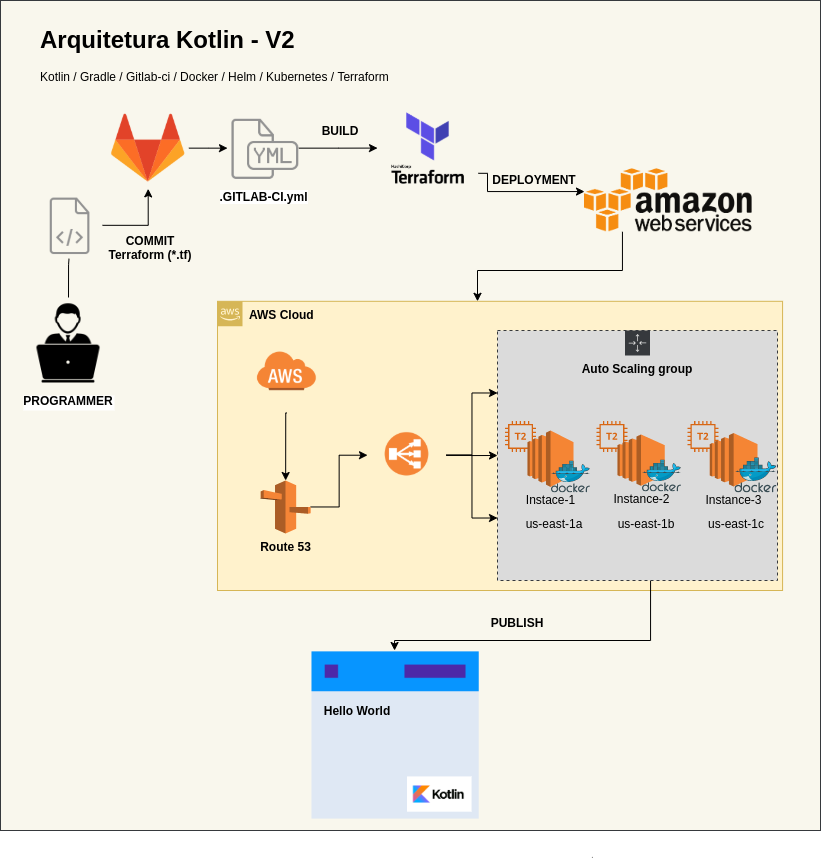

# TEO - Resultado de Desafio.

Este é um case para aplicação de tecnologias emergentes e com métodos aplicáveis em um ambiente empresarial.


## Etapas de Entrega do Projeto.

Containerização de uma aplicação em Kotlin.
Criação de um Helm chart para rodar em um cluster kubernetes.
Criação de uma Pipeline no GitLab CI.
Criação de uma Infraestrutura como código descrita em Terraform.
Criação da Infraestrutura como código na AWS via Pipeline.

## Exigências.

Pacotes necessários para execução deste case no GNU/Linux

* git >= 2.20.1
* Docker >= 19.03.8
* Helm >= 3.1.2
* Minikube >= 1.3.1
* Kotlin >= 1.2.61
* GitLab CI >= 12.9.0
* Gradle >= 4.10
* Terraform >= 0.12.24
 
## Exemplo de uso.

Para a reproduzir este desafio é necessário os seguintes passos para obter o êxito:

### Passo 1 - Instalação dos pacotes necessários:

**GIT**
```sh
$ sudo apt update
$ sudo apt install git 
```
Para os próximos passos será necessário realizar o clone do repositório conforme demostrado abaixo:

```sh
$ git clone https://github.com/fantonio/Teo.git
```

**DOCKER**
```sh
$ sudo apt-get update
$ sudo apt-get install \
    apt-transport-https \
    ca-certificates \
    curl \
    gnupg2 \
    software-properties-common
$ sudo curl -fsSL https://download.docker.com/linux/debian/gpg | sudo apt-key add -

# Neste próximo comando será necessário substituir a variável $HASH pelo resultado 
# dos ultimos caracteres na saída do comando acima.

$ sudo apt-key fingerprint $HASH
$ sudo add-apt-repository \
   "deb [arch=amd64] https://download.docker.com/linux/debian \
   $(lsb_release -cs) \
   stable"
$ sudo apt-get update
$ sudo apt-get install docker-ce docker-ce-cli containerd.io
```
**HELM**
```sh
$ sudo curl -fsSL -o get_helm.sh https://raw.githubusercontent.com/helm/helm/master/scripts/get-helm-3
$ sudo chmod 700 get_helm.sh
$ sudo ./get_helm.sh
```
**MINIKUBE**
```sh
$ sudo apt -y install qemu-kvm libvirt-daemon libvirt-daemon-system virtinst bridge-util
$ sudo curl -s https://packages.cloud.google.com/apt/doc/apt-key.gpg | apt-key add -
$ sudo apt update
$ sudo apt -y install kubectl
$ sudo wget https://storage.googleapis.com/minikube/releases/latest/minikube-linux-amd64 -O minikube
$ sudo chmod 755 minikube docker-machine-driver-kvm2
$ sudo mv minikube docker-machine-driver-kvm2 /usr/local/bin/
$ sudo minikube version
```
**GITLAB**
```sh
$ sudo apt update
$ sudo apt -y install curl vim openssh-server ca-certificates
$ sudo curl https://packages.gitlab.com/install/repositories/gitlab/gitlab-ce/script.deb.sh | sudo bash
$ sudo export GITLAB_URL="https://git.example.com"
$ sudo EXTERNAL_URL="${GITLAB_URL}" apt install gitlab-ce
$ sudo gitlab-ctl reconfigure

Acesso o endereço definido por você na variável GITLAB_URL em nosso exemplo utilizamos: http://gitlab.example.com
```
**TERRAFORM**
```sh
$ sudo TER_VER=`curl -s https://api.github.com/repos/hashicorp/terraform/releases/latest | grep tag_name | cut -d: -f2 | tr -d \"\,\v | awk '{$1=$1};1'`
$ sudo wget https://releases.hashicorp.com/terraform/${TER_VER}/terraform_${TER_VER}_linux_amd64.zip
$ sudo mv terraform /usr/local/bin/
```
### Passo 2 - Construção manual do Build e deploy do container da aplicação em Kotlin:

**DOCKER BUILD**
```sh
$ sudo docker build -t {username}/helloworld-kotlin .
```
**DOCKER TAG**
```sh
$ sudo docker tag helloworld-kotlin {username}/helloworld-kotlin
```
**DOCKER PUSH**
```sh
$ sudo docker push {username}/helloworld-kotlin .
```
### Passo 3 - Execução manual do deploy da aplicação:

**INICIANDO MINIKUBE**
```sh
$ sudo minikube start
$ sudo minikube status
$ sudo minikube service list
$ sudo kubectl cluster-info
$ sudo kubectl get nodes
```
**Realizando o Deploy via Helm**

Para seguirmos este passo é necessário irmos para a pasta parte1. Pois iremos executar de dentro o Helm que irá realizar o deploy da aplicação em kotlin.

```sh
$ cd Teo/parte1
$ helm install kotlin kotlin-chart
```

Para realizar o teste se a aplicação foi realmente feita o deploy, realize o seguinte comando:

```sh
$ minikube service kotlin
```

## Arquitetura Final



## Meta

Fábio A. Ferreira – [@fabaof](https://twitter.com/fabaof) – fantonios@gmail.com

## Resultados.

### Parte 1
Na etapa inicial descrita como parte 1, o resultado esperado é a containerização de aplicação em kotlin utilizando Dockerfile, onde após a criação de um helm chart será possível o deploy gerenciavél pelo Helm. Para que toda está entrega seja customizada via código será utilizado o Gitlab CI onde através de uma pipeline que está declarada em um arquivo **_gitlab-ci.yml_** terá os estágios: **test**, **build**, **package**, **deploy**.Após a execução destes passos o resultado esperado é a disponibilidade de um aplicação API REST em kotlin executando um HelloWorld e respondendo na porta 8080.

### Parte 2
Adiante na segunta descrita como parte 2, o resultado esperado é a criação de uma Infraestrutura como código. Criando uma automatização da criação da infraestrutura utilizando Terraform e realizando o deploy de uma aplicação na AWS.
Para esta etapa foi utilizado a criação de arquivos com extensão .tf na seguinte estrutura:
1. Criação de uma pasta terraform com os arquivos **main.tf** e **variables.tf** e uma pasta chamada **user-data** tendo um arquivo chamado **bootstrap.sh**. Contendo aqui todas as informações necessárias para a realização do provisionamento de uma infraestrutura na cloud da Amazon.
2. Foi criardo o arquivo **_gitlab-ci.yml_** para a construção da pipeline para o controle das versões e deployment desta infraestrutura como código.
3. Foi mantido as configurações dos arquivos Dockerfile para criação da imagem e os arquivos para realizar o deployment em um cluster kubernetes.
4. Para a criação desta infraestrutura é necessário a execução do pipeline instanciado em um servidor Gitlab.
5. O resultado final é a entrega de uma aplicação API REST em kotlin executando um HelloWorld e respondendo na porta 8080.

